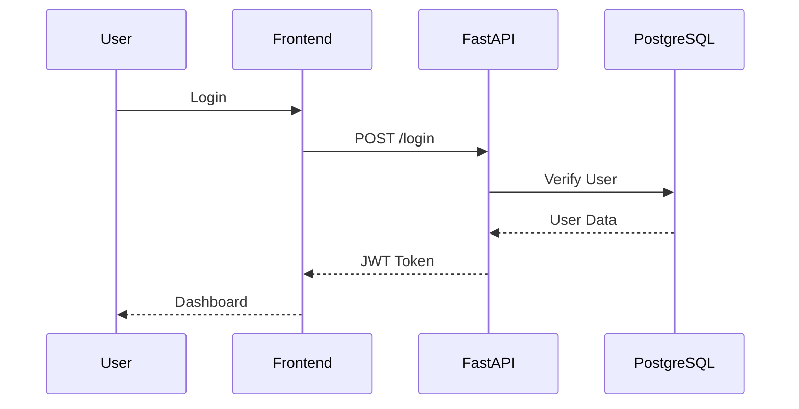
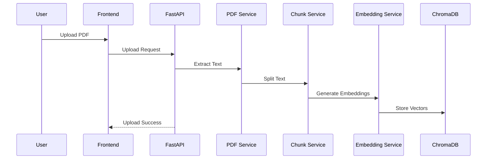
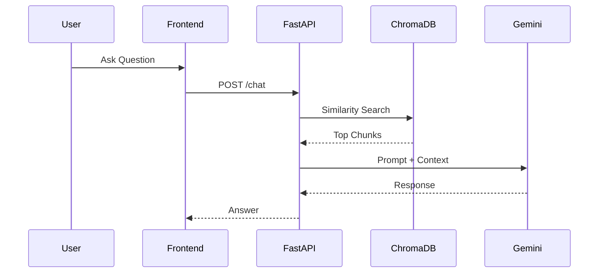

# System Sequence Diagrams

## User Login

```mermaid
sequenceDiagram

User->>Frontend: Login

Frontend->>FastAPI: POST /login

FastAPI->>PostgreSQL: Verify User

PostgreSQL-->>FastAPI: User Data

FastAPI-->>Frontend: JWT Token

Frontend-->>User: Dashboard
```

## Document Upload

```mermaid
sequenceDiagram

User->>Frontend: Upload PDF

Frontend->>FastAPI: Upload Request

FastAPI->>PDF Service: Extract Text

PDF Service->>Chunk Service: Split Text

Chunk Service->>Embedding Service: Generate Embeddings

Embedding Service->>ChromaDB: Store Vectors

FastAPI-->>Frontend: Upload Success
```

## RAG Query

```mermaid
sequenceDiagram

User->>Frontend: Ask Question

Frontend->>FastAPI: POST /chat

FastAPI->>ChromaDB: Similarity Search

ChromaDB-->>FastAPI: Top Chunks

FastAPI->>Gemini: Prompt + Context

Gemini-->>FastAPI: Response

FastAPI-->>Frontend: Answer
```