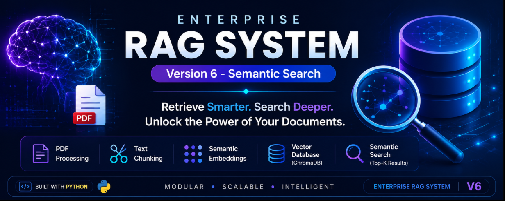
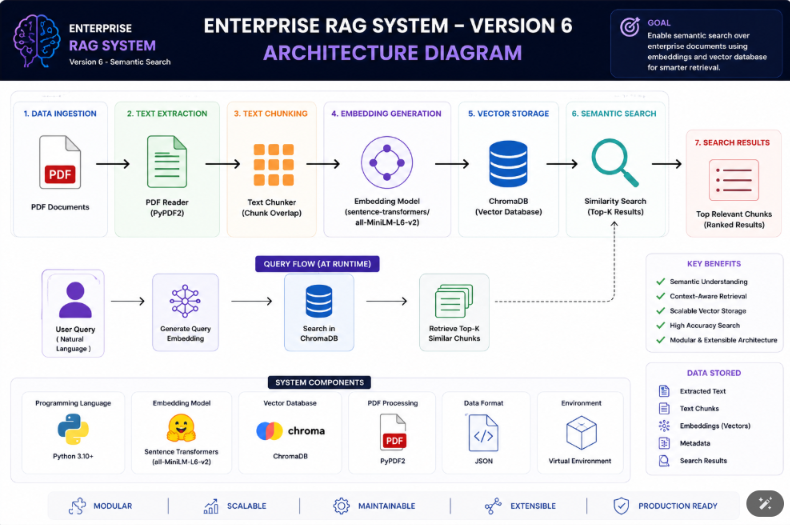
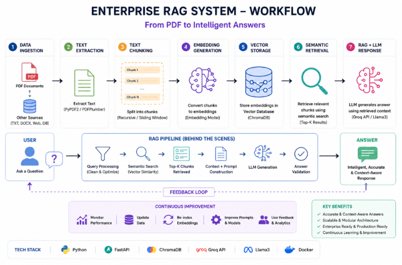
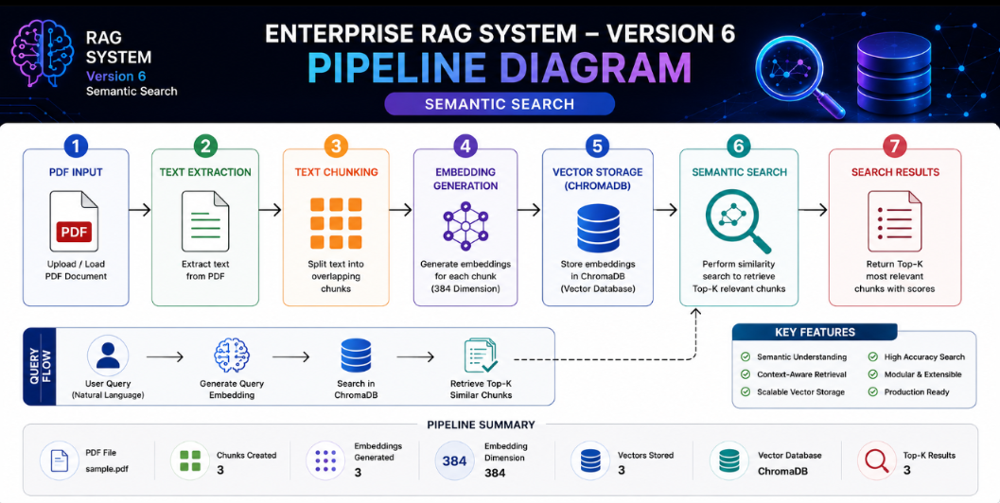

# 🚀 Enterprise RAG System
## Version 6 – Semantic Search

    

---

## 📖 Overview

Version 6 introduces **Semantic Search**, allowing users to retrieve the most relevant document chunks using vector similarity instead of keyword matching.

The system converts a user's natural language query into an embedding and performs a similarity search against embeddings stored in **ChromaDB**.

This version completes the **Retrieval** stage of the Retrieval-Augmented Generation (RAG) pipeline.

---

# ✨ Features

- 📄 PDF Text Extraction
- ✂️ Intelligent Text Chunking
- 🧠 Semantic Embedding Generation
- 💾 Persistent ChromaDB Storage
- 🔍 Semantic Similarity Search
- 🎯 Top-K Relevant Retrieval
- 📊 Ranked Search Results
- ⚡ High-Speed Vector Search
- 📝 Professional Logging
- 🧪 Unit Testing
- 🏗 Modular Architecture

---

# 🏗 System Architecture

    

---

# 🔄 Workflow

    

---

# 🚀 Pipeline

    

---

# 📂 Folder