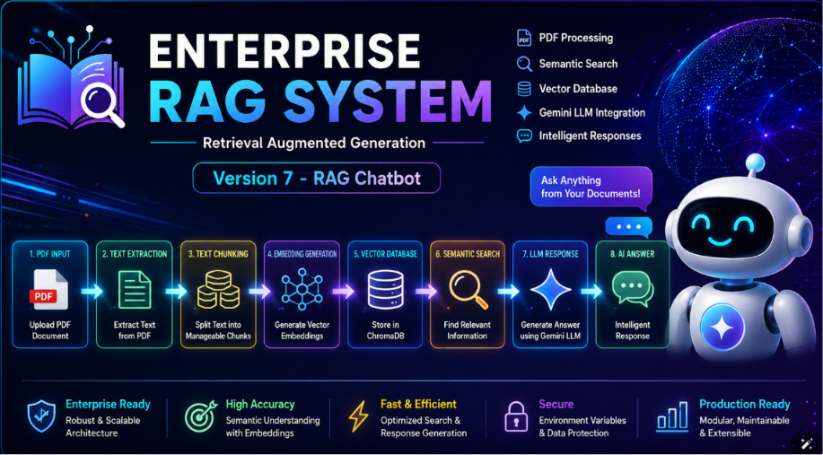
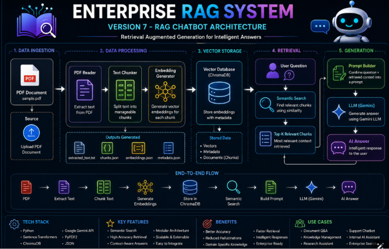
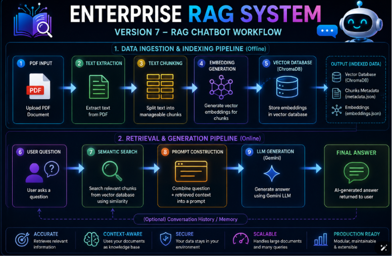
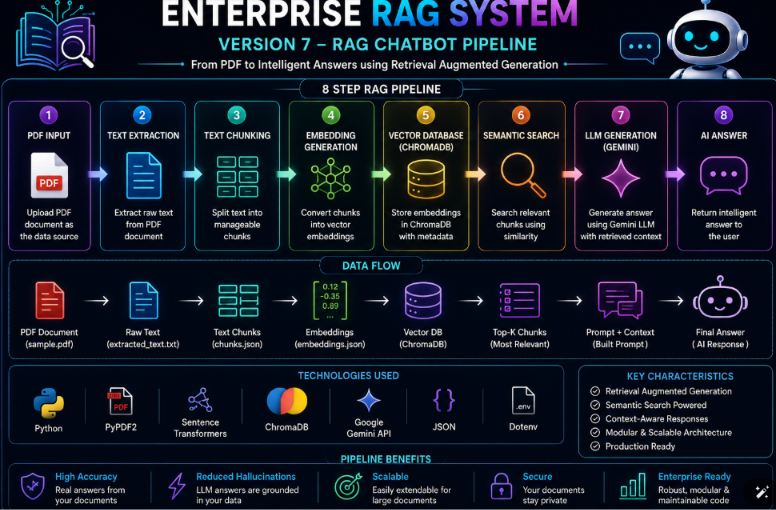

# 🚀 Enterprise RAG System

## Version 7 — RAG Chatbot

<p align="center">



</p>

<p align="center">


</p>

---

# 📖 Overview

Enterprise RAG System is a modular Retrieval-Augmented Generation (RAG) application that enables intelligent question answering over PDF documents using semantic search and Large Language Models (LLMs).

Instead of relying only on the model's pre-trained knowledge, the system retrieves the most relevant information from user-provided documents before generating a response. This significantly improves answer accuracy while reducing hallucinations.

Version 7 introduces a complete RAG chatbot capable of:

- Reading PDF documents
- Extracting text
- Splitting content into semantic chunks
- Generating embeddings using Sentence Transformers
- Storing vectors in ChromaDB
- Performing semantic similarity search
- Building contextual prompts
- Generating answers using Google's Gemini API

The project follows a clean, modular architecture designed for scalability, maintainability, and production-ready development.

---

---

# ✨ Features

Enterprise RAG System Version 7 provides an end-to-end Retrieval-Augmented Generation (RAG) pipeline for answering questions from PDF documents using semantic search and Google's Gemini LLM.

### Core Features

- 📄 Read and process PDF documents
- ✂️ Intelligent text chunking
- 🧠 Generate semantic embeddings using Sentence Transformers
- 🗄️ Store embeddings in ChromaDB
- 🔍 Perform semantic similarity search
- 🎯 Retrieve the most relevant document context
- 🤖 Generate AI-powered answers with Google Gemini
- 📝 Build context-aware prompts
- 📊 Display structured terminal output
- 📂 Modular and scalable project architecture
- ⚡ Fast and efficient document retrieval
- 🔄 Easily extendable for APIs and Web Applications

---

# 🏗️ System Architecture

<p align="center">
    
</p>

### Architecture Overview

The Enterprise RAG System follows a modular architecture where each component has a single responsibility. Documents are processed, converted into embeddings, stored in a vector database, and retrieved through semantic search before being sent to the Gemini Large Language Model for answer generation.

```text
PDF Document
      │
      ▼
PDF Reader
      │
      ▼
Text Chunker
      │
      ▼
Embedding Generator
      │
      ▼
ChromaDB Vector Database
      │
      ▼
Semantic Search
      │
      ▼
Prompt Builder
      │
      ▼
Gemini LLM
      │
      ▼
Generated Answer
```

---

# 🔄 Workflow

<p align="center">
    
</p>

### Workflow Steps

1. Load the PDF document.
2. Extract text from every page.
3. Split the extracted text into manageable chunks.
4. Convert each chunk into vector embeddings.
5. Store embeddings inside ChromaDB.
6. Accept the user's question.
7. Perform semantic similarity search.
8. Retrieve the most relevant chunks.
9. Build a context-rich prompt.
10. Send the prompt to Gemini.
11. Generate an intelligent answer.
12. Display the final response.

---

# ⚙️ RAG Pipeline

<p align="center">
    
</p>

### Complete Pipeline

```text
User Question
      │
      ▼
Semantic Search
      │
      ▼
Relevant Chunks
      │
      ▼
Prompt Builder
      │
      ▼
Gemini API
      │
      ▼
AI Response
      │
      ▼
Terminal Output
```

This pipeline ensures that every response is grounded in the uploaded document rather than relying solely on the language model's pre-trained knowledge. By combining semantic retrieval with a Large Language Model, the system produces more accurate, relevant, and context-aware answers while significantly reducing hallucinations.

---
---

# 📂 Folder Structure

<p align="center">
    
</p>

```text
rag-v7-rag-chatbot/
│
├── app.py
├── config.py
├── requirements.txt
├── README.md
├── LICENSE
├── CHANGELOG.md
├── CONTRIBUTING.md
├── .env
├── .gitignore
│
├── prompts/
│   └── prompt_builder.py
│
├── services/
│   ├── pdf_reader.py
│   ├── text_chunker.py
│   ├── embedding_generator.py
│   ├── embedding_service.py
│   ├── vector_database.py
│   ├── chroma_service.py
│   ├── semantic_search.py
│   ├── llm_service.py
│   └── rag_pipeline.py
│
├── utils/
│   ├── logger.py
│   ├── file_handler.py
│   └── terminal_ui.py
│
├── data/
│   └── sample.pdf
│
├── database/
│   └── chroma_db/
│
├── output/
│   ├── extracted_text.txt
│   ├── chunks.json
│   ├── embeddings.json
│   ├── search_results.json
│   └── answer.txt
│
├── logs/
│   └── application.log
│
├── docs/
│
├── assets/
│
└── tests/
```

### Folder Description

| Folder | Purpose |
|---------|---------|
| **services/** | Core RAG components such as PDF processing, embeddings, vector database, semantic search, and LLM integration. |
| **prompts/** | Prompt templates used to communicate with the Gemini model. |
| **utils/** | Utility modules for logging, file operations, and terminal interface. |
| **database/** | Persistent ChromaDB vector database. |
| **output/** | Generated files including extracted text, chunks, embeddings, search results, and answers. |
| **logs/** | Application log files for debugging and monitoring. |
| **assets/** | Images used in the README, including architecture, workflow, and screenshots. |
| **docs/** | Project documentation and design notes. |
| **tests/** | Unit and integration tests. |

---

# 🛠️ Technologies Used

| Technology | Purpose |
|------------|---------|
| Python 3.11 | Core programming language |
| PyPDF2 | PDF text extraction |
| Sentence Transformers | Text embedding generation |
| ChromaDB | Vector database |
| Google Gemini API | Large Language Model |
| python-dotenv | Environment variable management |
| NumPy | Numerical operations |
| JSON | Data storage |
| Logging | Application monitoring |
| Git & GitHub | Version control |

---

# 📋 Prerequisites

Before running the project, ensure you have the following installed:

- Python **3.11** or later
- Git
- A Google Gemini API Key
- Internet connection (required for Gemini API)

---

# ⚙️ Installation

### 1. Clone the repository

```bash
git clone https://github.com/your-username/rag-v7-rag-chatbot.git
```

### 2. Navigate to the project directory

```bash
cd rag-v7-rag-chatbot
```

### 3. Create a virtual environment

**Windows**

```bash
python -m venv .venv
```

Activate it:

```bash
.venv\Scripts\activate
```

**Linux / macOS**

```bash
python3 -m venv .venv
source .venv/bin/activate
```

### 4. Install dependencies

```bash
pip install -r requirements.txt
```

---

# 🔑 Configuration (.env)

Create a `.env` file in the project root and add your Gemini API key:

```env
GEMINI_API_KEY=YOUR_GEMINI_API_KEY
```

The application automatically loads this key using `python-dotenv`.

---

---

# ▶️ Running the Project

After installing all dependencies and configuring the `.env` file, start the application by running:

```bash
python app.py
```

If everything is configured correctly, the application will:

- Initialize the logger
- Load the PDF document
- Extract text from the PDF
- Split the text into semantic chunks
- Generate embeddings
- Store embeddings in ChromaDB
- Accept user questions
- Perform semantic search
- Build the prompt
- Send the prompt to Google Gemini
- Display the AI-generated answer

---

# ⚙️ How It Works

The Enterprise RAG System follows a Retrieval-Augmented Generation (RAG) workflow to answer user questions based on document content.

## Step 1 – Load the Document

The PDF Reader loads the document and extracts text from every page.

```
PDF
      │
      ▼
Extract Text
```

---

## Step 2 – Split into Chunks

Large documents are divided into smaller semantic chunks for efficient retrieval.

```
Extracted Text
      │
      ▼
Text Chunks
```

---

## Step 3 – Generate Embeddings

Each chunk is converted into a dense vector representation using Sentence Transformers.

```
Text Chunk
      │
      ▼
Embedding Vector
```

---

## Step 4 – Store in ChromaDB

The generated embeddings are stored inside ChromaDB for fast similarity search.

```
Embedding
      │
      ▼
ChromaDB
```

---

## Step 5 – Ask a Question

The user enters a natural language question.

Example:

```
What is Python?
```

---

## Step 6 – Semantic Search

The system searches the vector database to find the most relevant document chunks.

```
Question
      │
      ▼
Semantic Search
      │
      ▼
Relevant Chunks
```

---

## Step 7 – Prompt Construction

The retrieved context is combined with the user's question to create a high-quality prompt for the language model.

```
Relevant Context
+
User Question
      │
      ▼
Prompt Builder
```

---

## Step 8 – Gemini Response

The prompt is sent to Google's Gemini API, which generates a context-aware answer.

```
Prompt
      │
      ▼
Gemini API
      │
      ▼
Answer
```

---

# 💻 Sample Terminal Output

<p align="center">
    
</p>

Example:

```text
==================================================
         Enterprise RAG System - Version 7
==================================================

✓ PDF Loaded Successfully

✓ Text Extracted

✓ Chunks Generated

✓ Embeddings Created

✓ ChromaDB Initialized

✓ Semantic Search Ready

Ask a Question:

> What is Python?

Searching...

Generating Response...

Answer:

Python is a high-level programming language widely used for web development,
artificial intelligence, automation, data science, and software engineering.

==================================================
Pipeline Completed Successfully
==================================================
```

---

# 📈 Project Statistics

| Metric | Value |
|---------|------:|
| Version | 7.0 |
| Architecture | Modular |
| Language | Python |
| Embedding Model | Sentence Transformers |
| Vector Database | ChromaDB |
| LLM | Google Gemini |
| Retrieval | Semantic Search |
| Status | ✅ Completed |

---

# 🎯 Learning Outcomes

By completing Version 7, you will understand:

- PDF document processing
- Text chunking strategies
- Semantic embeddings
- Vector databases
- Similarity search
- Retrieval-Augmented Generation (RAG)
- Prompt engineering
- Google Gemini API integration
- Modular software architecture
- Building production-ready AI applications

---

---

# 🗺️ Project Roadmap

The Enterprise RAG System is being developed incrementally to understand every component of a production-grade Retrieval-Augmented Generation (RAG) application.

| Version | Module | Status |
|----------|--------|--------|
| ✅ V1 | PDF Reader | Completed |
| ✅ V2 | Text Chunking | Completed |
| ✅ V3 | Keyword Search | Completed |
| ✅ V4 | Semantic Embeddings | Completed |
| ✅ V5 | Vector Database (ChromaDB) | Completed |
| ✅ V6 | Semantic Search | Completed |
| ✅ V7 | RAG Chatbot | Completed |
| ⏳ V8 | FastAPI REST API | Planned |
| ⏳ V9 | Streamlit Web Interface | Planned |
| ⏳ V10 | Production Deployment | Planned |

---

# 🚀 Future Improvements

The following enhancements are planned for future versions of the Enterprise RAG System:

- REST API using FastAPI
- Interactive Streamlit Web Interface
- Multi-PDF document support
- PDF upload functionality
- Chat history management
- Conversation memory
- Support for multiple LLM providers
- Metadata-based document filtering
- Hybrid Search (Keyword + Semantic Search)
- Authentication and user management
- Docker containerization
- Cloud deployment
- CI/CD pipeline integration
- Monitoring and logging dashboard
- Performance optimization

---

# 👨‍💻 Author

## Shiva Shankar Reddy

**Computer Science Engineering Student**

**Generative AI Backend Developer (Learning Journey)**

I am passionate about building scalable AI applications using Python, Retrieval-Augmented Generation (RAG), Large Language Models (LLMs), FastAPI, and modern backend technologies.

This Enterprise RAG System is a step-by-step learning project where every version focuses on understanding one core concept before moving to the next. The goal is not just to build a chatbot, but to understand the complete architecture behind production-ready AI systems.

### Connect with Me

- GitHub: https://github.com/Shivareddy83
- LinkedIn: *(Add your LinkedIn profile URL here)*

---

# 🤝 Contributing

Contributions, suggestions, and feedback are welcome.

If you'd like to improve this project:

1. Fork the repository.
2. Create a new feature branch.
3. Commit your changes with clear messages.
4. Push the branch to your fork.
5. Open a Pull Request.

Please read the **CONTRIBUTING.md** file before submitting major changes.

---

# 📄 License

This project is licensed under the **MIT License**.

See the **LICENSE** file for more information.

---

# 🙏 Acknowledgements

Special thanks to the open-source community and the creators of the amazing tools used in this project.

- Python
- Sentence Transformers
- ChromaDB
- Google Gemini API
- PyPDF2
- Hugging Face
- Git & GitHub

Your contributions to the AI ecosystem make projects like this possible.

---

# ⭐ Support

If you found this project useful, consider giving it a ⭐ on GitHub.

It helps others discover the project and motivates future development.

---

<p align="center">

Made with ❤️ using Python, RAG, ChromaDB, and Google Gemini.

</p>