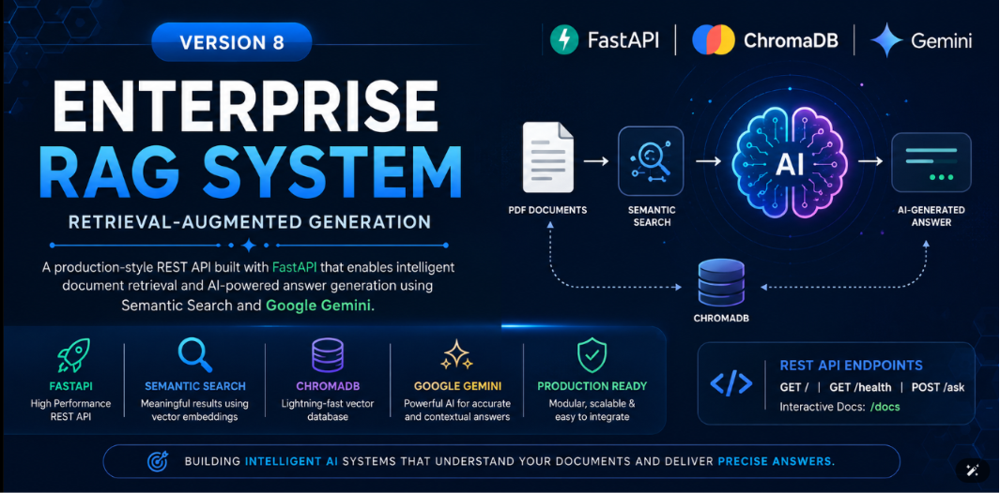
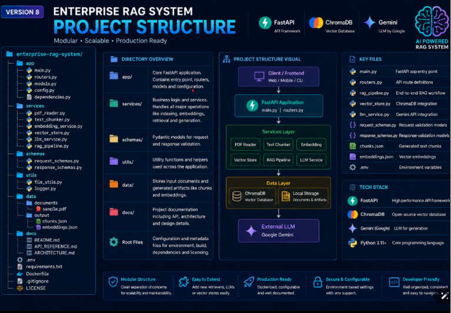
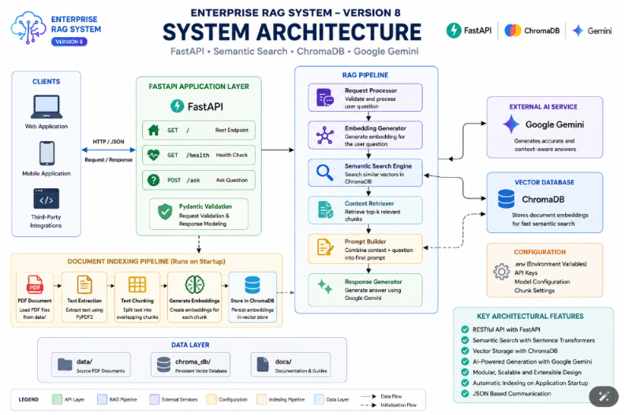
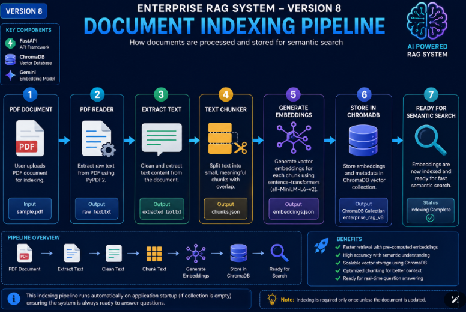
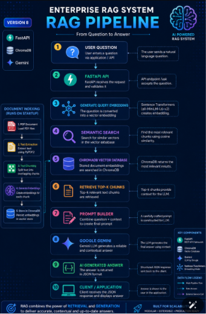
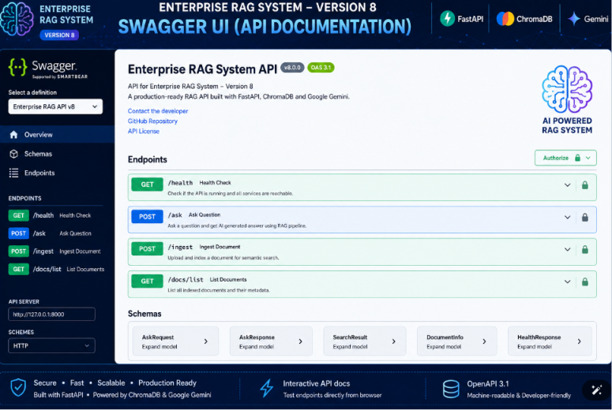
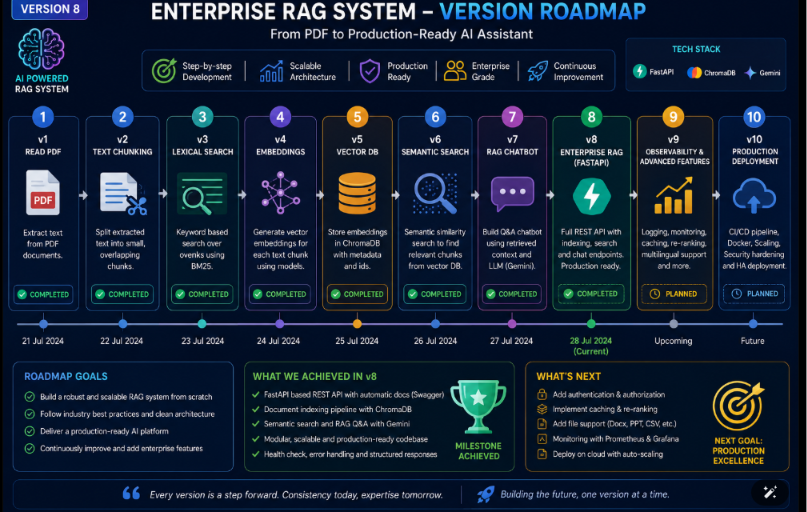
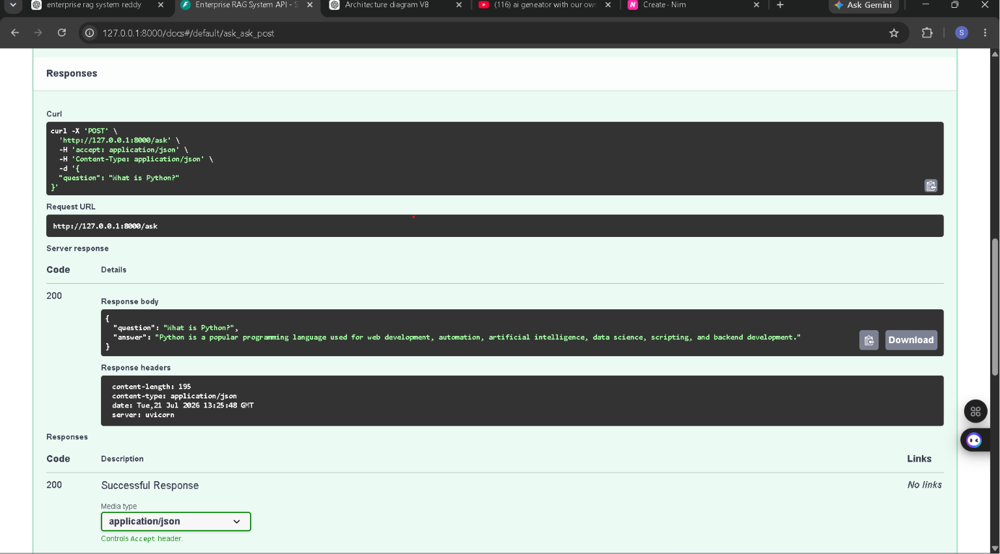
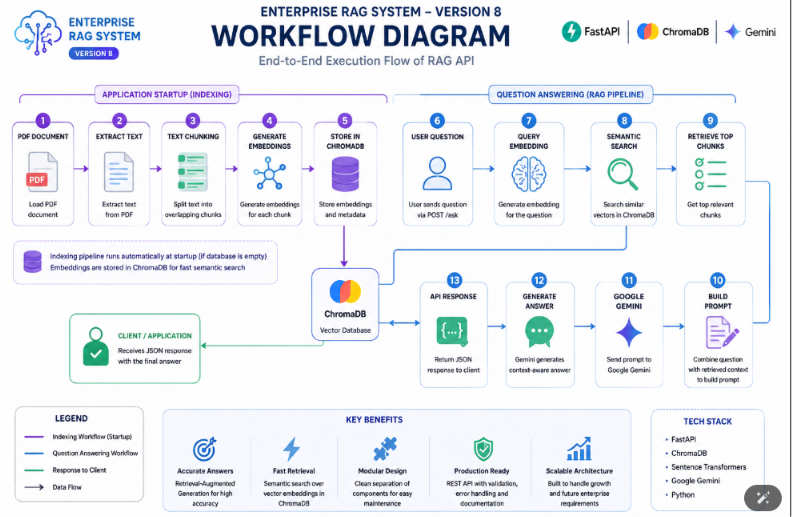
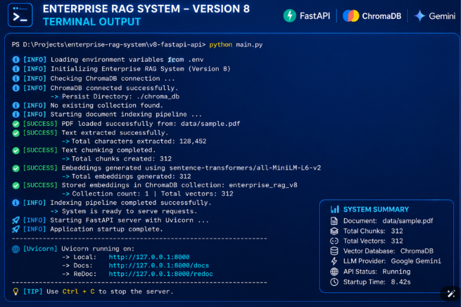

# Enterprise RAG System – Version 8

## FastAPI REST API with Semantic Search & Google Gemini

<p align="center">
  
</p>

---

# 1. Project Overview

Explain:

- What is this project?
- Why was Version 8 built?
- What problem does it solve?
- Who can use it?

---

# 2. Features

- REST API using FastAPI
- Interactive Swagger UI
- Semantic Search
- ChromaDB Vector Database
- Sentence Transformer Embeddings
- Google Gemini Integration
- Automatic Document Indexing
- Modular Architecture
- Health Check API
- JSON Request & Response
- Clean Folder Structure

---

# 3. Technology Stack

## Programming Language

- Python

## Backend

- FastAPI
- Uvicorn

## Vector Database

- ChromaDB

## Embedding Model

- Sentence Transformers
- all-MiniLM-L6-v2

## Large Language Model

- Google Gemini 2.5 Flash

## Libraries

- PyPDF2
- python-dotenv
- Pydantic

## Development Tools

- VS Code
- Git
- GitHub

---

# 4. Project Structure

(Add folder tree)

<p align="center">
  
</p>

Explain each folder and file.

---

# 5. System Architecture

<p align="center">
  
</p>

Explain:

Client

↓

FastAPI

↓

RAG Pipeline

↓

Semantic Search

↓

ChromaDB

↓

Prompt Builder

↓

Google Gemini

↓

JSON Response

---

# 6. Document Indexing Pipeline

<p align="center">
  
</p>

Explain how PDFs are:

- Read
- Extracted
- Chunked
- Embedded
- Stored in ChromaDB

---

# 7. RAG Pipeline

<p align="center">
  
</p>

Explain the complete Retrieval-Augmented Generation pipeline.

---

# 8. API Endpoints

| Method | Endpoint | Description |
|---------|----------|-------------|
| GET | `/` | Root Endpoint |
| GET | `/health` | Health Check |
| POST | `/ask` | Ask Questions |

---

## Swagger Documentation

<p align="center">
  
</p>

---

## Health Endpoint

<p align="center">
  
</p>

---

## Ask Endpoint

<p align="center">
  
</p>

---

# 9. Installation

Clone the repository.

```bash
git clone <repository-url>
```

Create a virtual environment.

Install dependencies.

Configure environment variables.

---

# 10. Configuration

Create a `.env` file.

```env
GEMINI_API_KEY=your_api_key
```

Explain:

- Chunk Size
- Chunk Overlap
- Embedding Model
- ChromaDB Directory
- Collection Name

---

# 11. Running the Project

Activate the virtual environment.

Run the FastAPI server.

```bash
uvicorn main:app --reload
```

Open:

```
http://127.0.0.1:8000/docs
```

Test the APIs.

---

# 12. Sample Request & Response

### Request

```json
{
  "question": "What is Python?"
}
```

### Response

```json
{
  "question": "What is Python?",
  "answer": "Python is a versatile programming language..."
}
```

---

# 13. Workflow

<p align="center">
  
</p>

Explain:

User Question

↓

FastAPI

↓

Generate Query Embedding

↓

Semantic Search

↓

Retrieve Chunks

↓

Prompt Builder

↓

Google Gemini

↓

JSON Response

---

# 14. Terminal Output

<p align="center">
  
</p>

Show successful startup, indexing, and server initialization.

---

# 15. Future Improvements

- PDF Upload API
- Multiple Document Support
- Conversation Memory
- User Authentication
- Docker Support
- Cloud Deployment
- Streaming Responses
- Citation Support

---

# 16. Learning Outcomes

Explain what was learned:

- FastAPI
- REST API Development
- Semantic Search
- Sentence Transformers
- ChromaDB
- Prompt Engineering
- Google Gemini Integration
- Modular Software Design

---

# 17. Version History

| Version | Feature |
|----------|---------|
| V1 | PDF Reader |
| V2 | Text Chunking |
| V3 | Keyword Search |
| V4 | Semantic Embeddings |
| V5 | Vector Database |
| V6 | Semantic Search |
| V7 | RAG Chatbot |
| V8 | FastAPI REST API |

<p align="center">
  
</p>


## 💬 Ask Endpoint

The `POST /ask` endpoint accepts a natural language question, performs semantic retrieval using ChromaDB, generates a context-aware response with Google Gemini, and returns the result in JSON format.

<p align="center">
  
</p>

---

# 18. Author

**Shiva Shankar Reddy**

B.Tech – Computer Science & Engineering

Generative AI Backend Developer

GitHub: *(Repository Link)*

LinkedIn: *(Profile Link)*

---

# 19. License

This project is licensed under the **MIT License**.

See the `LICENSE` file for details.